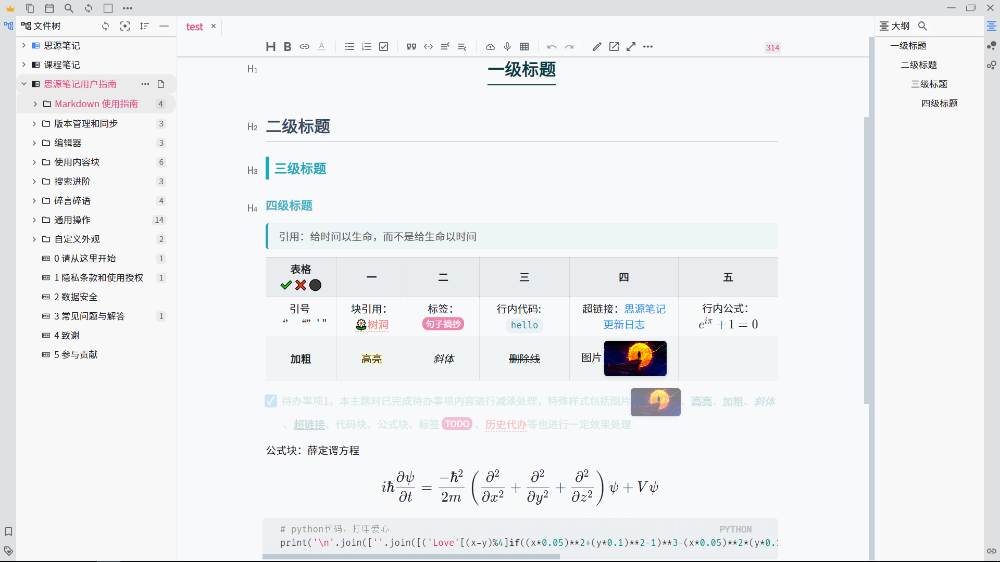

<h1 align="center">🌞Tsundoku: A Theme for SiYuan Note</h1>

          
           
           
           
           
           
          

[English](./README.md)  | 中文

**简介**：[思源笔记(Siyuan)](https://github.com/siyuan-note/siyuan)是一款本地优先的个人知识管理系统，支持完全离线使用，同时也支持端到端加密同步。融合块、大纲和双向链接，构建你永恒的数字花园。本主题为个人原创主题，专为思源笔记设计。

Light 主题

Green 主题

Dark 主题

## 🚀更新情况

见 [CHANGE_LOGS](./CHANGE_LOGS.md)

## 💌 缘起

🎉 主题最早诞生于2021.02.22

Tsundoku “積 ん 読”是日语里的一个词，维基百科是这样解释的“Tsundoku is acquiring reading materials but letting them pile up in one's home without reading them. It is also used to refer to books ready for reading later when they are on a bookshelf.” 简单说就是买书成瘾却不读的行为。
> Any PKM approach that doesn't tie into execution tools is destined to languish on the back burner forever.

使用一个工具的最大障碍是「需求不清」，如果不清楚自己的记录需求是什么，那功能越多，可能造成的障碍越大，很容易就使人陷进去对功能的各种研究中去了。用完一堆笔记软件之后你会明白：最需要提升的并不是你所用的工具，**而是你自己**。

我借此名来警醒自己，希望能利用好思源笔记，帮助我养成每日记录、定期回顾复盘的习惯，更好地掌握知识和技能，争取做有意义的项目，变成更优秀的人，而不是为了记笔记而笔记，让笔记软件成为一个个缓解知识焦虑的积灰箱，满足变态的数字化囤积症。

## 🐯 主题特色功能  

- ✨ **主题三合一，同时支持明亮模式和暗黑模式**（Tsundoku Light、Tsundoku Green、Tsundoku Dark）【参考自[Savor](https://github.com/royc01/notion-theme) 】  
  - 思源笔记明亮模式只支持选择light和green，暗黑模式只支持选择dark主题
  - **如果明亮模式和暗黑模式都设置为使用Tsundoku主题**：从暗黑模式切换为明亮模式，根据之前的明亮模式选择自动更改为green主题/light主题；从明亮模式切换为暗黑模式，自动更改为dark主题
  
- 📎**为超链接添加了icon**：区别不同的本地链接和网络链接，详见[超链接图标介绍](https://www.yuque.com/achuan-2/siyuan/gar358)
  
- 🧊 **引入语雀提示区块**：给引述块blockquote添加块背景颜色，就会自动应用样式，详见[语雀提示区块样式](https://www.yuque.com/achuan-2/siyuan/obxpvr)
  

## 😺 借鉴功能

- [Dark+主题](https://github.com/Zuoqiu-Yingyi/siyuan-theme-dark-plus)
  - 右键块菜单可以用monaco-editor以markdown样式打开当前块或文档，方便批量编辑，支持 Ctrl+S 保存内容
- [HBuilderX-Light主题](https://github.com/UFDXD/HBuilderX-Light)
  - 列表转脑图、表格
  - 表格设置是否显示表头和表宽度调整
- [Savor主题](https://github.com/royc01/notion-theme)
  - 主题切换按钮
- [日历面板](https://github.com/HowcanoeWang/calendar)
  - 支持根据笔记本日记路径模板智能识别“2006.01.02”或“2006-01-02”格式（不支持更复杂的格式）
  - 支持点击查看已有日记以及提前新建未来日记

## 🐭自定义属性
  - 使用方式：单击块标选择打开属性列表或Shift+Click打开，点击添加，输入属性名（e.g. f），并输入相应的属性值（e.g.  hide）
  - 自定义块属性列表
  
    | 属性key  | 属性值value | 功能                       | 备注            |
    | ----------- | ------------- | ---------------------------- | ----------------- |
    | f         | hide/挖空                  | 挖空块 |  |
    | code      | output      | 专门用来放输出结果的代码块 |                 |
    | f         | kb          | 列表转看板                 | Ref：notion主题 |
    | f         | dt          | 列表转脑图                 | Ref：notion主题 |
    | f         | dg          | 列表转表格                 | Ref：notion主题 |
    | f         | full        | 表格宽度为页面宽度         | Ref：notion主题 |
    | f         | biaotou     | 表格表头不加粗             | Ref：notion主题 |
    
  - 自定义文档属性
    | 属性key  | 属性值value | 功能             |
    | ---------- | ------------- | ------------------ |
    | img      | center      | 文档全部图片居中 |
    | linkicon | no          | 超链接取消icon   |
    | title-num | true          | 标题自动编号   |

## ❤ 致谢

- https://github.com/Zuoqiu-Yingyi/siyuan-theme-dark-plus
- https://github.com/UFDXD/HBuilderX-Light
- https://github.com/royc01/notion-theme
- https://github.com/HowcanoeWang/calendar

## ☎️意见交流

若主题存在样式的问题，欢迎在Github提issue或是通过邮箱联系我(achuan-2@outlook.com)。在提issue之前建议先切换为默认主题，确定是本主题特有的问题。

