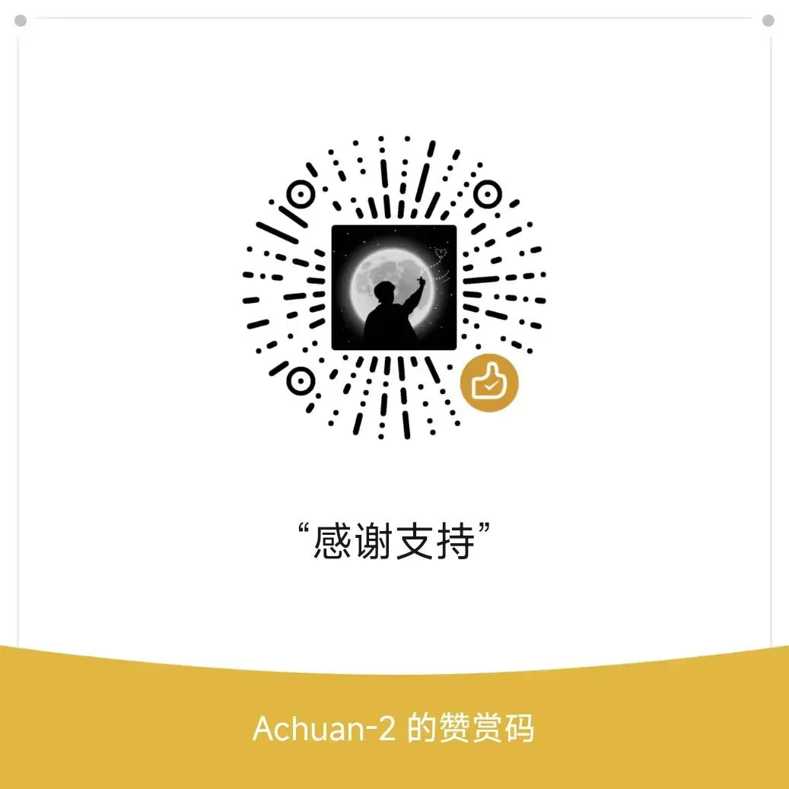

<h1 align="center">🌞Tsundoku: A Theme for SiYuan Note</h1>

<p align="center">          
           <a title="Hits" target="_blank" href="https://github.com/Achuan-2/siyuan-themes-tsundoku-light"></a>
           <a title="GitHub release (latest by date including pre-releases)" target="_blank" href="https://github.com/Achuan-2/siyuan-themes-tsundoku/releases/latest">
                 
           </a>
           
           
           
          
</p>

[English](./README.md)  | 中文


> 如果你喜欢本主题，欢迎[给我买包辣条](https://afdian.net/a/achuan-2)，这会激励我更新和完善主题

**简介**：[思源笔记(Siyuan)](https://github.com/siyuan-note/siyuan)是一款本地优先的个人知识管理系统，支持完全离线使用，同时也支持端到端加密同步。融合块、大纲和双向链接，构建你永恒的数字花园。本主题为个人原创主题，专为思源笔记设计。

## 🚀最近更新

 v2.1.0 / 2024.05.07
- 📝  README 添加标题小圆点层级提示和无序列表层级样式的代码片段
- 💄 调整代码块样式
- 💄 导出预览模式复制到微信公众号，加粗文字颜色设置为蓝色

v2.0.8 / 2024.05.06
- ✨ 代码块设置最大高度优化：适配行号


v2.0.6 / 2024.04.30
- ✨ 思源笔记预览模式直接复制到微信公众号适配
- 💄 超链接样式调整
- 💄 备注样式调整，取消背景色，变为橙色下划线
- 💄 适配思源v3.0.12的图标样式
- 💄 代码块样式修改
  - 调整代码行号宽度
  - 调整代码语言位置
  - 调整代码内容与左侧的间隔
- 💄 标题样式修改
  - h3 标题样式：左边添加竖线
  - h1 标题样式：居中加下划线
- 💄优化导出pdf的超链接下划线样式


全部更新日志请见 [CHANGELOG](./CHANGELOG.md)

## 💌 缘起

🎉 主题最早诞生于 2021.02.22

Tsundoku “積 ん 読”是日语里的一个词，维基百科是这样解释的“Tsundoku is acquiring reading materials but letting them pile up in one's home without reading them. It is also used to refer to books ready for reading later when they are on a bookshelf.” 简单说就是买书成瘾却不读的行为。
> Any PKM approach that doesn't tie into execution tools is destined to languish on the back burner forever.

使用一个工具的最大障碍是「需求不清」，如果不清楚自己的记录需求是什么，那功能越多，可能造成的障碍越大，很容易就使人陷进去对功能的各种研究中去了。用完一堆笔记软件之后你会明白：最需要提升的并不是你所用的工具，**而是你自己**。

我借此名来警醒自己，希望能利用好思源笔记，帮助我养成每日记录、定期回顾复盘的习惯，更好地掌握知识和技能，争取做有意义的项目，变成更优秀的人，而不是为了记笔记而笔记，让笔记软件成为一个个缓解知识焦虑的积灰箱，满足变态的数字化囤积症。


## 🐯 主题特色功能  

- ✨ **主题三合一，同时支持明亮模式和暗黑模式**（Tsundoku Light、Tsundoku Green、Tsundoku Dark）
  - 思源笔记明亮模式只支持选择light和green，暗黑模式只支持选择dark主题
  - **如果明亮模式和暗黑模式都设置为使用Tsundoku主题**：从暗黑模式切换为明亮模式，根据之前的明亮模式选择自动更改为green主题/light主题；从明亮模式切换为暗黑模式，自动更改为dark主题
  
- 📎**为超链接添加了icon**：区别不同的本地链接和网络链接
  
- 🧊 **Callout 块**：给引述块blockquote添加块背景颜色，就会自动应用样式
  
  
  推荐使用模板添加emoji以及调整标题字体大小和加粗，下面是一个例子
  ```markdown
  > **💡  标题**{: style="font-size: 24px;"}
  >
  > 内容
  {: id="20231019114031-5bqqmpr" style="background-color: var(--b3-card-error-background); color: var(--b3-card-error-color);"}
  ```


## 😺 借鉴功能

- [HBuilderX-Light主题](https://github.com/UFDXD/HBuilderX-Light)
  - 列表转脑图、表格
  - 表格设置是否显示表头和表格宽度调整
- [Savor主题](https://github.com/royc01/notion-theme)
  - 主题切换按钮


## 🐭自定义属性
  - 使用方式：单击块标选择打开属性列表或Shift+Click打开，点击添加，输入属性名（e.g. f），并输入相应的属性值（e.g.  hide）
  - 自定义块属性列表
  
    | 属性key<br /> | 属性值value | 功能                       | 备注            |
    | ----------- | ------------- | ---------------------------- | ----------------- |
    | f         | hide/挖空                  | 挖空块 |  |
    | code      | output      | 专门用来放输出结果的代码块 |                 |
    | f         | kb          | 列表转看板                 | Ref：notion主题 |
    | f         | dt          | 列表转脑图                 | Ref：notion主题 |
    | f         | dg          | 列表转表格                 | Ref：notion主题 |
    | f         | biaotou     | 表格表头不加粗             | Ref：notion主题 |
    
  - 自定义文档属性
    | 属性key  | 属性值value | 功能             |
    | ---------- | ------------- | ------------------ |
    | img      | center      | 文档全部图片居中 |
    | linkicon | no          | 超链接取消icon   |
    | title-num | true          | 标题自动编号   |

## ⚙️ 一些关于主题的设置

### 主题推荐字体

汉仪空山楷，这是本人目前最喜欢的字体

如果希望手机端和电脑端都是用同一字体，可以遵循以下步骤
1. 字体文件放在思源笔记工作空间的`data/plugins`文件夹，使字体可以被同步到手机端，举例，我放在`plugins/custom-fonts/`文件夹
2. 在思源笔记【**设置-外观-代码片段**】添加如下代码片段（注：如果使用不同的字体，记得更改字体路径和名称）
    ```css
    @font-face {
    font-family: "汉仪空山楷";
    font-style: normal;
    src: url("plugins/custom-fonts/汉仪空山楷.ttf");
    }

    :root {
    --b3-font-family: "汉仪空山楷", "Helvetica Neue", "Luxi Sans", "DejaVu Sans", "Hiragino Sans GB", "Microsoft Yahei", "sans-serif","Twitter Emoji","Apple Color Emoji", "Segoe UI Emoji", "Noto Color Emoji", "Segoe UI Symbol", "Android Emoji", "EmojiSymbols" !important;

    }


    ```

### Green 主题如何关闭纹理背景
在思源笔记【**设置-外观-代码片段**】添加如下代码片段：

<details>
  <summary>Green 主题如何关闭纹理背景</summary>

```css
.protyle-wysiwyg * {
background-image:none !important;

}

body * {
background-image:none !important;

}
```
</details>


### h1 主题默认居中，如何改为居左

在思源笔记【**设置-外观-代码片段**】添加如下代码片段：
<details>
  <summary> h1 主题改为居左</summary>

```css
.protyle-wysiwyg .h1 {
text-align:left !important;
border-bottom: none;
}
```
</details>

### h3-h5 添加背景色

在思源笔记【**设置-外观-代码片段**】添加如下代码片段：
<details>
  <summary>h3-h5 添加背景色</summary>

```css
.protyle-wysiwyg [data-node-id].h3,
.b3-typography h3 {
    /* h3标题基本样式 */
    font-size: 1.35em !important;
    color: var(--b3-card-info-color);
    background-color: var(--b3-card-info-background);
    box-shadow: 2px 2px 2px var(--b3-table-border-color);
}
.protyle-wysiwyg [data-node-id].h4,
.b3-typography h4 {
    /* h5标题基本样式 */
    font-size: 1.2em !important;
    color: var(--b3-card-success-color);
    background-color: var(--b3-card-success-background);
    box-shadow: 2px 2px 2px var(--b3-table-border-color);
}
.protyle-wysiwyg [data-node-id].h5,
.b3-typography h5 {
    /* h6标题基本样式 */
    font-size: 1.1em !important;
    color: var(--custom-h5-color);
    background-color: var(--b3-font-background9);
    box-shadow: 2px 2px 2px var(--b3-table-border-color);
}

```
</details>


### 无序列表添加层级样式

在思源笔记【**设置-外观-代码片段**】添加如下代码片段：

<details>
  <summary>无序列表添加层级样式代码</summary>

```css
[data-subtype="u"]>.li[data-subtype="u"]>.protyle-action svg{
	color:transparent;
}

[data-subtype="u"]>.li[data-subtype="u"]>.protyle-action::before {
    font-size: 1.5em;
    line-height: 1;
    margin-bottom: 0px;
	margin-left:13px;
    font-family: Arial;
	content: "•";
}

[data-subtype="u"]>[data-subtype="u"] .li[data-subtype="u"]>.protyle-action::before{
	content: "◦";
}
[data-subtype="u"]>[data-subtype="u"] .li[data-subtype="u"] .li[data-subtype="u"]>.protyle-action::before{
	content: "▪";
}
[data-subtype="u"]>[data-subtype="u"] .li[data-subtype="u"] .li[data-subtype="u"] .li[data-subtype="u"]>.protyle-action::before{
	content: "•";
}
[data-subtype="u"]>[data-subtype="u"] .li[data-subtype="u"] .li[data-subtype="u"] .li[data-subtype="u"] .li[data-subtype="u"]>.protyle-action::before{
	content: "◦";
}
[data-subtype="u"]>[data-subtype="u"] .li[data-subtype="u"] .li[data-subtype="u"] .li[data-subtype="u"] .li[data-subtype="u"] .li[data-subtype="u"]>.protyle-action::before{
	content: "▪";
}
[data-subtype="u"]>[data-subtype="u"] .li[data-subtype="u"] .li[data-subtype="u"] .li[data-subtype="u"] .li[data-subtype="u"] .li[data-subtype="u"] .li[data-subtype="u"]>.protyle-action::before{
	content: "•";
}
[data-subtype="u"]>[data-subtype="u"] .li[data-subtype="u"] .li[data-subtype="u"] .li[data-subtype="u"] .li[data-subtype="u"] .li[data-subtype="u"] .li[data-subtype="u"] .li[data-subtype="u"]>.protyle-action::before{
	content: "◦";
}
[data-subtype="u"]>[data-subtype="u"] .li[data-subtype="u"] .li[data-subtype="u"] .li[data-subtype="u"] .li[data-subtype="u"] .li[data-subtype="u"] .li[data-subtype="u"] .li[data-subtype="u"] .li[data-subtype="u"]>.protyle-action::before{
	content: "▪";
}
[data-subtype="u"]>[data-subtype="u"] .li[data-subtype="u"] .li[data-subtype="u"] .li[data-subtype="u"] .li[data-subtype="u"] .li[data-subtype="u"] .li[data-subtype="u"] .li[data-subtype="u"] .li[data-subtype="u"] .li[data-subtype="u"]>.protyle-action::before{
	content: "•";
}
[data-subtype="u"]>[data-subtype="u"] .li[data-subtype="u"] .li[data-subtype="u"] .li[data-subtype="u"] .li[data-subtype="u"] .li[data-subtype="u"] .li[data-subtype="u"] .li[data-subtype="u"] .li[data-subtype="u"] .li[data-subtype="u"] .li[data-subtype="u"]>.protyle-action::before{
	content: "◦";
}
[data-subtype="u"]>[data-subtype="u"] .li[data-subtype="u"] .li[data-subtype="u"] .li[data-subtype="u"] .li[data-subtype="u"] .li[data-subtype="u"] .li[data-subtype="u"] .li[data-subtype="u"] .li[data-subtype="u"] .li[data-subtype="u"] .li[data-subtype="u"] .li[data-subtype="u"]>.protyle-action::before{
	content: "▪";
}

```


</details>

### 标题后添加小圆点

在思源笔记【**设置-外观-代码片段**】添加如下代码片段：


<details>
  <summary>标题后添加小圆点</summary>

```css

:root {
    --h1-list-graphic: #eb8383;
	--h2-list-graphic: #ae9acb;
	--h3-list-graphic: #63a4c1;
	--h4-list-graphic: #71a796;
	--h5-list-graphic: #3b51a4;
	--h6-list-graphic: #dda36a;
}


.protyle-wysiwyg .h1>[spellcheck]:not(:empty)::after{
	content:"";
	position:absolute;
	float:left;
	margin-left:5px;
	height:0.45em;
	width:0.15em;
	bottom:0.5em;
	border-radius:3px;
	background-color:var(--h1-list-graphic);
	opacity:0.5;
}
.protyle-wysiwyg [data-node-id].li > .protyle-action ~ .h1>[spellcheck]::after{
	bottom:0.2em;
}

.protyle-wysiwyg .h2>[spellcheck]:not(:empty)::after{
	content:"";
	position:absolute;
	float:left;
	margin-left:5px;
	height:0.16em;
	width:0.16em;
	bottom:0.76em;
	border-radius:3px;
	background-color:var(--h2-list-graphic);
	opacity:0.5;
	box-shadow: 0.25em 0.25em 0 0 var(--h2-list-graphic);
}
.protyle-wysiwyg [data-node-id].li > .protyle-action ~ .h2>[spellcheck]::after{
	bottom:0.5em;
}

.protyle-wysiwyg .h3>[spellcheck]:not(:empty)::after{
	content:"";
	position:absolute;
	float:left;
	margin-left:5px;
	height:0.16em;
	width:0.16em;
	bottom:0.62em;
	border-radius:3px;
	background-color:var(--h3-list-graphic);
	opacity:0.5;
	box-shadow: 0.25em 0.25em 0 0 var(--h3-list-graphic),0 0.25em 0 0 var(--h3-list-graphic);
}

.protyle-wysiwyg .h4>[spellcheck]:not(:empty)::after{
	content:"";
	position:absolute;
	float:left;
	margin-left:5px;
	height:0.15em;
	width:0.15em;
	bottom:0.68em;
	border-radius:3px;
	background-color:var(--h4-list-graphic);
	opacity:0.5;
	box-shadow: 0.25em 0.25em 0 0 var(--h4-list-graphic),0 0.25em 0 0 var(--h4-list-graphic),0.25em 0 0 0 var(--h4-list-graphic);
}

.protyle-wysiwyg .h5>[spellcheck]:not(:empty)::after{
	content:"";
	position:absolute;
	float:left;
	margin-left:5px;
	height:0.15em;
	width:0.15em;
	bottom:0.8em;
	border-radius:3px;
	background-color:var(--h5-list-graphic);
	opacity:0.5;
	box-shadow: 0.25em 0.25em 0 0 var(--h5-list-graphic),0 0.25em 0 0 var(--h5-list-graphic),0.25em 0 0 0 var(--h5-list-graphic),0 -0.25em 0 0 var(--h5-list-graphic);
}

.protyle-wysiwyg .h6>[spellcheck]:not(:empty)::after{
	content:"";
	position:absolute;
	float:left;
	margin-left:5px;
	height:0.15em;
	width:0.15em;
	bottom:0.9em;
	border-radius:3px;
	background-color:var(--h6-list-graphic);
	opacity:0.5;
	box-shadow: 0.25em 0.25em 0 0 var(--h6-list-graphic),0 0.25em 0 0 var(--h6-list-graphic),0.25em 0 0 0 var(--h6-list-graphic),0 -0.25em 0 0 var(--h6-list-graphic),0.25em -0.25em 0 0 var(--h6-list-graphic);
}

```
</details>


## ❤ 致谢

- https://github.com/Zuoqiu-Yingyi/siyuan-theme-dark-plus
- https://github.com/UFDXD/HBuilderX-Light
- https://github.com/royc01/notion-theme


## ☎️意见交流

若主题存在样式的问题，欢迎在[Github](https://github.com/Achuan-2/siyuan-themes-tsundoku)提issue或是通过邮箱联系我(achuan-2@outlook.com)。在提issue之前建议先切换为默认主题，确定是本主题特有的问题。


<div align="center">
  
</div>